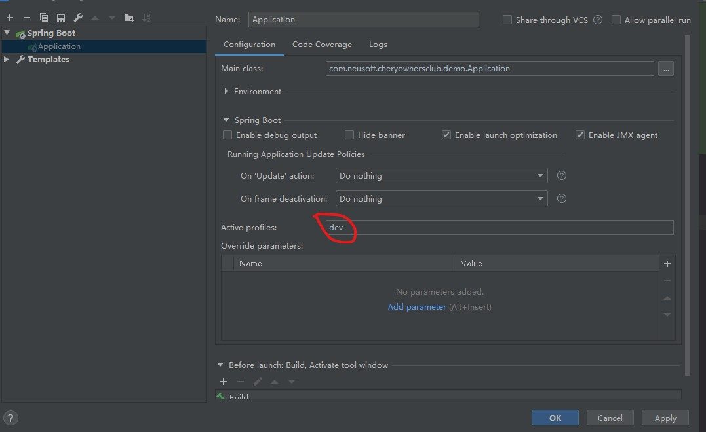

# structure

#### 介绍
structure 是基于spring boot 开箱即用原则封装常用starter 主要用户快速开发的脚手架，第一次整理希望对小伙伴能有帮助，也希望更多人一起整理
structure 并不是代码的生产者我们只是代码的搬运工希望能够收集更优秀的作品和插件，也希望更多人的加入我们一起整理更优秀的插件和作品
#### 软件架构
软件架构说明
- structure-parent 为父项目，主要作用是对项目中的公共依赖进行封装对版本进行定义
- structure-dependencies 子模块主要对 structure 中的模块 进行版本定义
- structure-mybatis-plugin-starter 该模块为 mybatis 扩展插件 starter
- structure-redis-plugin-starter 该模块主要对redis 的简单封装其中主要是对redis锁的封装 
- structure-redisson-plugin-starter 主要对redisson锁的封装和缓存注解的封装
- structure-web-plugin-starter 对web相关插件的封装 例如 接口日志输出，方法日志注解，fastJson出参转换 Swagger2的开启，公共异常的捕获
#### 安装教程

1.  下载项目 https://gitee.com/lcq_java/structure.git
2.  在 structure-parent 为父项目 install 
3.  在项目pom中添加dependencyManagement 的引用 structure-dependencies
4.  在pom 中引用对应的 starter 并开启相对应的功能详情见使用说明
#### 使用说明
[structrue 文档 ](https://gitee.com/lcq_java/structure/wikis/)
#### 安装idea 辅助插件 ####
Lombok  + Alibaba Java Coding Guidelines （阿里巴巴代码规范工具） + GenerateAllSetter（代码生成工具）Alt + Enter 可生成GetSet默认值
#### 环境变量配置 #### 


#### 配置kubectl ####
1. 下载 [kubectl工具](resources/kubectl.zip)
2. 解压到D盘和环境变量中一致 
3. 将下载的config 复制到 用户目录下的 .kube 目录 没有目录请自行创建即可

4. 校验是否成功

#### 配置pom ####
拷贝POM配置
```XML
<?xml version="1.0" encoding="UTF-8"?>
<project xmlns="http://maven.apache.org/POM/4.0.0" xmlns:xsi="http://www.w3.org/2001/XMLSchema-instance"
         xsi:schemaLocation="http://maven.apache.org/POM/4.0.0 https://maven.apache.org/xsd/maven-4.0.0.xsd">
    <modelVersion>4.0.0</modelVersion>
    <parent>
        <groupId>org.springframework.boot</groupId>
        <artifactId>spring-boot-starter-parent</artifactId>
        <version>2.1.2.RELEASE</version>
        <relativePath/> <!-- lookup parent from repository -->
    </parent>
    <groupId>org.structure.boot</groupId>
    <artifactId>demo-mybatis-plus</artifactId>
    <version>1.0.1</version>
    <name>demo-mybatis-plus</name>
    <description>demo-mybatis-plus 测试项目 </description>
    <properties>
        <java.version>1.8</java.version>
        <structure.version>1.1.0</structure.version>
    </properties>
    <dependencies>
        <dependency>
            <groupId>org.springframework.boot</groupId>
            <artifactId>spring-boot-starter</artifactId>
        </dependency>
        <dependency>
            <groupId>org.springframework.boot</groupId>
            <artifactId>spring-boot-starter-web</artifactId>
        </dependency>
        <dependency>
            <groupId>org.structure.boot</groupId>
            <artifactId>structure-mybatis-plugin-starter</artifactId>
        </dependency>
        <!-- mybatis plus starter -->
        <dependency>
            <groupId>com.baomidou</groupId>
            <artifactId>mybatis-plus-boot-starter</artifactId>
        </dependency>
        <!-- mybatis plus 生成工具-->
        <dependency>
            <groupId>com.baomidou</groupId>
            <artifactId>mybatis-plus-generator</artifactId>
        </dependency>
        <!-- mybatis plus 生成模板-->
        <dependency>
            <groupId>org.apache.velocity</groupId>
            <artifactId>velocity-engine-core</artifactId>
        </dependency>
        <dependency>
            <groupId>org.springframework.boot</groupId>
            <artifactId>spring-boot-starter-test</artifactId>
            <scope>test</scope>
            <exclusions>
                <exclusion>
                    <groupId>org.junit.vintage</groupId>
                    <artifactId>junit-vintage-engine</artifactId>
                </exclusion>
            </exclusions>
        </dependency>
    </dependencies>
    <dependencyManagement>
        <dependencies>
            <dependency>
                <groupId>org.structure.boot</groupId>
                <artifactId>structure-dependencies</artifactId>
                <version>1.1.0.RELEASE</version>
                <type>pom</type>
                <scope>import</scope>
            </dependency>
        </dependencies>
    </dependencyManagement>
    <build>
        <plugins>
            <plugin>
                <groupId>org.springframework.boot</groupId>
                <artifactId>spring-boot-maven-plugin</artifactId>
            </plugin>
        </plugins>
    </build>
</project>
```
### 项目结构说明 ###
    projectName
        /src/main/java/package      #package 为你项目的基础包
            configuration   #存放项目中的配置
            constants       #存放常量
            controller      #controller
                api         #存放api包
                openfeign   #存放内部调用的feign接口
            enums           #枚举包
                ErrCodeEnum.java #该服务内部的错误枚举
            logic           #逻辑目录
                client      #存放client目录用于远程调用的client
                manager     #manager层目录用于存放service和mapper中间层公共业务
                service     #service包
                    impl    #service实现包
            pojo        #POJO包
                bo      #BO 业务内使用的实体
                po      #数据库对象实体
                vo      #接口对象实体
            repository  #实例化仓库包
                mapper  #mapper仓库
                   provider #mapper SQL 提供者
            utils       #工具类
            Application.java    #启动类
            GenMybatisPlus.java #代码生成器
        /src/main/resources/resources
            mapper   #mybatis-plus  xml配置路径 推荐使用无XML化
        pom
        
- 根据以上结构创建目录
### 配置启动程序 ####
```java
package com.demo;
import org.mybatis.spring.annotation.MapperScan;
import org.springframework.boot.SpringApplication;
import org.springframework.boot.autoconfigure.SpringBootApplication;
import org.springframework.cloud.client.discovery.EnableDiscoveryClient;
import org.springframework.cloud.openfeign.EnableFeignClients;
/**
 * <p>
 *  @EnableFeignClients 如果涉及调用其他服务需要开启FeignClients扫描
 *  @EnableDiscoveryClient 开启客户端注册到注册中心
 *  @MapperScan 扫描mapper --- com.neusoft.cheryownersclub.demo.repository.mapper 对应项目中mapper的目录
 * </p>
 * @author: CHUCK
 * @date: 2020/11/9 17:03
 * @description:
 */

@EnableFeignClients
@SpringBootApplication
@EnableDiscoveryClient
@MapperScan("repository.mapper")
public class Application {
    public static void main(String[] args) {
        SpringApplication.run(Application.class,args);
    }
}
```
### 配置yml ###

```yaml
management:
  endpoint:
    restart:
      enabled: true
    health:
      enabled: true
    info:
      enabled: true
spring:
  profiles:
    active: dev 
  application:
    name: svc-demo
  cloud:
    kubernetes:
      client:
        namespace: default
      namespace: default
      reload:
        #自动更新配置的开关设置为打开
        enabled: true
        #更新配置信息的模式是主动拉取
        mode: polling
        #主动拉取的间隔时间是500毫秒
        period: 500
      config: # 如果是多品牌请使用多个分支管理上线修改配置文件
        sources:
            #当前项目独立的配置
          - name: ${spring.application.name}
            namespace: ${spring.cloud.kubernetes.namespace}
          - name: common-config
            #公共配置
            namespace: ${spring.cloud.kubernetes.namespace}
server:
  port: 28001

```
### 配置启动参数 ### 

### demo示例 ###
#### 参数校验的使用 ####
1. 在接口上使用@Valid 和@RequestBody注解
```java
package com.demo.controller.api;
import com.neusoft.cheryownersclub.common.pojo.vo.ResultVO;
import com.neusoft.cheryownersclub.demo.logic.service.IOauthAdminUserService;
import com.neusoft.cheryownersclub.demo.pojo.vo.ReqFindAccountVO;
import com.neusoft.cheryownersclub.demo.pojo.vo.ResAccountListVO;
import com.structure.starter.pojo.ResPageVO;
import io.swagger.annotations.Api;
import io.swagger.annotations.ApiOperation;
import org.springframework.web.bind.annotation.GetMapping;
import org.springframework.web.bind.annotation.RequestMapping;

import org.springframework.web.bind.annotation.RestController;

import javax.annotation.Resource;
import javax.validation.Valid;

/**
 * <p>
 * 管理员账户表 前端控制器
 * </p>
 *
 * @author chuck
 * @since 2020-11-07
 */
@Api(tags = "管理员账户模块")
@RestController
@RequestMapping("/api/account")
public class OauthAdminUserController {
    @Resource
    private IOauthAdminUserService iOauthAdminUserService;
    @ApiOperation(value = "后台管理查询系统账号")
    @GetMapping(value = "/queryAccountPageList")
    public ResultVO<ResPageVO<ResAccountListVO>> findAccountPageList(@RequestBody @Valid ReqFindAccountVO reqFindAccountVO){
        System.out.println("reqFindAccountVO = " + reqFindAccountVO);
        ResPageVO<ResAccountListVO> accountPageList = iOauthAdminUserService.findAccountPageList(reqFindAccountVO);
        return ResultVO.success(accountPageList);
    }
}
```
2. 在VO参数上使用约束注解
```java
package com.demo.pojo.vo;
import com.structure.starter.pojo.ReqPageVO;
import io.swagger.annotations.ApiModel;
import io.swagger.annotations.ApiModelProperty;
import lombok.Data;
import org.hibernate.validator.constraints.Length;


/**
 * @author: CHUCK
 * @date: 2020/11/7 17:39
 * @description: 入参：账户列表分页 - VO
 */
@Data
@ApiModel(description = "入参：账户列表分页 - VO")
public class ReqFindAccountVO extends ReqPageVO {
    @Length(max = 20)
    @ApiModelProperty(value = "账号名称 不超过20个字符")
    private String username;
    @ApiModelProperty(value = "角色id")
    private String roleId;
    @ApiModelProperty(value = "启用1/停用0，默认为启用状态")
    private Integer isEnable;
}

```
入参校验使用 validation 插件

@AssertFalse 可以为null,如果不为null的话必须为false

@AssertTrue 可以为null,如果不为null的话必须为true

@DecimalMax 设置不能超过最大值

@DecimalMin 设置不能超过最小值

@Digits 设置必须是数字且数字整数的位数和小数的位数必须在指定范围内

@Future 日期必须在当前日期的未来

@Past 日期必须在当前日期的过去

@Max 最大不得超过此最大值

@Min 最大不得小于此最小值

@NotNull 不能为null，可以是空

@Null 必须为null

@Pattern 必须满足指定的正则表达式

@Size 集合、数组、map等的size()值必须在指定范围内

@Email 必须是email格式

@Length 长度必须在指定范围内

@NotBlank 字符串不能为null,字符串trim()后也不能等于“”

@NotEmpty 不能为null，集合、数组、map等size()不能为0；字符串trim()后可以等于“”

@Range 值必须在指定范围内

@URL 必须是一个URL

    @ApiModelProperty(value = "用户昵称")
    @NotBlank(message = "名称不能为空")
    @Length(max = 128,message = "超出最大长度限制！")
    private String name;

    @ApiModelProperty(value = "用户性别")
    @Min(value = 0,message = "最大值 = 0")
    @Max(value = 2,message = "最大值 = 2")
    private Integer sax;

#### 分页示例 ####
1. 接口示例
        @ApiOperation(value = "后台管理查询系统账号")
        @GetMapping(value = "/queryListSystemAccount")
        public ResultVO<ResPageVO<ResAccountListVO>> findAccountPageList(@Valid ReqFindAccountVO reqFindAccountVO){
            System.out.println("reqFindAccountVO = " + reqFindAccountVO);
            ResPageVO<ResAccountListVO> accountPageList = iOauthAdminUserService.findAccountPageList(reqFindAccountVO);
            return ResultVO.success(accountPageList);
        }
2. 业务示例
        public ResPageVO<ResAccountListVO> findAccountPageList(ReqFindAccountVO reqFindAccountVO) {
                //PageHelper 的分页用法
                PageHelper.startPage(reqFindAccountVO.getPageNum(),reqFindAccountVO.getPageSize());
                //构建mybatis 查询参数
                QueryWrapper<OauthAdminUser> queryWrapper = new QueryWrapper();
                OauthAdminUser oauthAdminUser = new OauthAdminUser();
                queryWrapper.setEntity(oauthAdminUser);
                queryWrapper.le("create_time",reqFindAccountVO.getPageTime());
                queryWrapper.orderByDesc("create_time");
                //通过mapper查询数据
                List<OauthAdminUser> list = oauthAdminUserMapper.selectList(queryWrapper);
                //构建分页信息
                PageInfo<OauthAdminUser,ResAccountListVO> pageInfo = new PageInfo(list);
                //构建出参信息
                ResPageVO<ResAccountListVO> resPageVO = pageInfo.getResPage(reqFindAccountVO.getPageTime());
                //构建出参集合
                List<ResAccountListVO> resAccountListVOList = Lists.newArrayList();
                //遍历po对象转换为vo对象
                list.forEach(i-> {
                    ResAccountListVO resAccountListVO = new ResAccountListVO();
                    resAccountListVO.setAccountId(i.getId());
                    resAccountListVO.setUsername(i.getUserName());
                    //todo …… 详细的实现
                    resAccountListVO.setRoleName(i.getRoleId());
                    //添加到出参集合中
                    resAccountListVOList.add(resAccountListVO);
                });
                //将出参集合赋值给公共分页出参
                resPageVO.setDateList(resAccountListVOList);
                return resPageVO;
            }
### feign调用示例 ###
1. 在client中创建接口代码如下
```java
package com.demo.logic.client;

import com.neusoft.cheryownersclub.common.pojo.vo.ResultVO;
import org.springframework.cloud.openfeign.FeignClient;
import org.springframework.web.bind.annotation.RequestMapping;
/**
 * <p>
 *     @FeignClient(name = "service-b" ) name 为对应服务的服务名
 * </p>
 * @author: CHUCK
 * @date: 2020/11/2 14:04
 * @description: 测试Client
 */
@FeignClient(name = "service-b" )
public interface ITestClient {

    /**
     * <p>
     *     @RequestMapping(value = "/findTest")
     *     value 为对应服务的完成url 比如 /user/findUserInfo
     *     result 返回结果和服务提供者的返回结果一致 该对象存放在 openFeign 项目中
     *     http://10.10.94.190/chery-ownersclub/open-feign-vo.git
     * </p>
     */
    @RequestMapping(value = "/findTest")
    ResultVO findTest();
}

```
2. 在业务中使用

        @Resource
        private ITestClient iTestClient;
    
        /**
         * demo示例
         */
        public ResultVO demoClient(){
            ResultVO test = iTestClient.findTest();
            //判断处理是成功如果 仅限于演示并非必须
            if (!ResultCodeEnum.SUCCESS.getCode().equals(test.getCode())) {
                return test;
            }
            //正常处理
            return ResultVO.success(null);
        }
### k8s的使用 ###
开发时利用 svc.yaml来注册到k8s

kubectl replace -f develop.yml  --validate=false
```yaml
---
apiVersion: v1
kind: Endpoints
metadata:
  name: svc-demo
  namespace: default
subsets:
  - addresses:
      - ip: 10.10.92.211 #你的Ip地址
    ports:
      - name: svc-demo  #你的项目
        port: 28001  #你的端口
        protocol: TCP
---
apiVersion: v1
kind: Service
metadata:
  name: svc-demo
  namespace: default
spec:
  type: NodePort
  ports:
    - name: svc-demo
      port: 28001
      protocol: TCP
      targetPort: 28001
```
### 规范说明 ####
参考阿里巴巴开发规范

#### 编程规约 ####
##### 命名规约 ####
1. 【强制】所有编程相关命名均不能以下划线或美元符号开始，也不能以下划线或美元符号结束。
反例： _name / __name / $Object / name_ / name$ / Object$

2. 【强制】所有编程相关的命名严禁使用拼音与英文混合的方式，更不允许直接使用中文的方式。
说明：正确的英文拼写和语法可以让阅读者易于理解，避免歧义。注意，即使纯拼音命名方式
也要避免采用。
反例： DaZhePromotion [打折] / getPingfenByName() [评分] / int 变量 = 3;
正例： ali / alibaba / taobao / cainiao / aliyun / youku / hangzhou 等国际通用的
名称，可视为英文。

3. 【强制】类名使用 UpperCamelCase 风格，必须遵从驼峰形式，但以下情形例外：（领域模型
的相关命名）DO / DTO / VO / DAO 等。
正例：MarcoPolo / UserDO / XmlService / TcpUdpDeal / TaPromotion
反例：macroPolo / UserDo / XMLService / TCPUDPDeal / TAPromotion

4. 【强制】方法名、参数名、成员变量、局部变量都统一使用 lowerCamelCase 风格，必须遵从
驼峰形式。
正例： localValue / getHttpMessage() / inputUserId

5. 【强制】常量命名全部大写，单词间用下划线隔开，力求语义表达完整清楚，不要嫌名字长。
正例： MAX_STOCK_COUNT
反例： MAX_COUNT

6. 【强制】抽象类命名使用 Abstract 或 Base 开头；异常类命名使用 Exception 结尾；测试类命
名以它要测试的类的名称开始，以 Test 结尾。

7. 【强制】中括号是数组类型的一部分，数组定义如下：String[] args;
反例：请勿使用 String args[]的方式来定义

8. 【强制】POJO 类中的任何布尔类型的变量，都不要加 is，否则部分框架解析会引起序列化错
误。
反例：定义为基本数据类型 boolean isSuccess；的属性，它的方法也是 isSuccess()，RPC
框架在反向解析的时候，“以为”对应的属性名称是 success，导致属性获取不到，进而抛出
异常。

9. 【强制】包名统一使用小写，点分隔符之间有且仅有一个自然语义的英语单词。包名统一使用
单数形式，但是类名如果有复数含义，类名可以使用复数形式。
正例： 应用工具类包名为 com.alibaba.mpp.util、类名为 MessageUtils（此规则参考 spring
的框架结构）

10. 【强制】杜绝完全不规范的缩写，避免望文不知义。
反例：<某业务代码>AbstractClass“缩写”命名成 AbsClass；condition“缩写”命名成
condi，此类随意缩写严重降低了代码的可阅读性。

11.【推荐】如果使用到了设计模式，建议在类名中体现出具体模式。
说明：将设计模式体现在名字中，有利于阅读者快速理解架构设计思想。
正例：public class OrderFactory;
public class LoginProxy;
public class ResourceObserver;

12. 【推荐】接口类中的方法和属性不要加任何修饰符号（public 也不要加），保持代码的简洁
性，并加上有效的 javadoc 注释。尽量不要在接口里定义变量，如果一定要定义变量，肯定是
与接口方法相关，并且是整个应用的基础常量。
正例：接口方法签名：void f();
 接口基础常量表示：String COMPANY = "alibaba";
反例：接口方法定义：public abstract void f();
说明：JDK8 中接口允许有默认实现，那么这个 default 方法，是对所有实现类都有价值的默
认实现。

13. 接口和实现类的命名有两套规则：
 - 【强制】对于 Service 和 DAO 类，基于 SOA 的理念，暴露出来的服务一定是接口，内部
的实现类用 Impl 的后缀与接口区别。
正例：CacheServiceImpl 实现 CacheService 接口。
 - 【推荐】 如果是形容能力的接口名称，取对应的形容词做接口名（通常是–able 的形
式）。

正例：AbstractTranslator 实现 Translatable。

14.【参考】枚举类名建议带上 Enum 后缀，枚举成员名称需要全大写，单词间用下划线隔开。
说明：枚举其实就是特殊的常量类，且构造方法被默认强制是私有。
正例：枚举名字：DealStatusEnum；成员名称：SUCCESS / UNKOWN_REASON。

15.【参考】各层命名规约：

- Service/DAO 层方法命名规约
1.  获取单个对象的方法用 get 做前缀。
2.  获取多个对象的方法用 list 做前缀。
3.  获取统计值的方法用 count 做前缀。
4.  插入的方法用 save（推荐）或 insert 做前缀。
5.  删除的方法用 remove（推荐）或 delete 做前缀。
6.  修改的方法用 update 做前缀。
- 领域模型命名规约
1.  数据对象：xxxDO，xxx 即为数据表名。
2.  数据传输对象：xxxDTO，xxx 为业务领域相关的名称。
3.  展示对象：xxxVO，xxx 一般为网页名称。
4.  POJO 是 DO/DTO/BO/VO 的统称，禁止命名成 xxxPOJO。
5.  使用PO代替DO和DTO

##### 常量定义 #####

1. 【强制】不允许出现任何魔法值（即未经定义的常量）直接出现在代码中。
反例： String key="Id#taobao_"+tradeId；
cache.put(key, value);

2. 【强制】long 或者 Long 初始赋值时，必须使用大写的 L，不能是小写的 l，小写容易跟数字 1
混淆，造成误解。
说明：Long a = 2l; 写的是数字的 21，还是 Long 型的 2?

3. 【推荐】不要使用一个常量类维护所有常量，应该按常量功能进行归类，分开维护。如：缓存
相关的常量放在类：CacheConsts 下；系统配置相关的常量放在类：ConfigConsts 下。
说明：大而全的常量类，非得 ctrl+f 才定位到修改的常量，不利于理解，也不利于维护。

4. 【推荐】常量的复用层次有五层：跨应用共享常量、应用内共享常量、子工程内共享常量、包
内共享常量、类内共享常量。

-  跨应用共享常量：放置在二方库中，通常是 client.jar 中的 const 目录下。
-  应用内共享常量：放置在一方库的 modules 中的 const 目录下。

反例：易懂变量也要统一定义成应用内共享常量，两位攻城师在两个类中分别定义了表示
“是”的变量：

类 A 中：public static final String YES = "yes";
类 B 中：public static final String YES = "y";
A.YES.equals(B.YES)，预期是 true，但实际返回为 false，导致产生线上问题。
-  子工程内部共享常量：即在当前子工程的 const 目录下。
-  包内共享常量：即在当前包下单独的 const 目录下。
-  类内共享常量：直接在类内部 private static final 定义。
-  【推荐】如果变量值仅在一个范围内变化用 Enum 类。如果还带有名称之外的延伸属性，必须
使用 Enum 类，下面正例中的数字就是延伸信息，表示星期几。
正例：public Enum{ MONDAY(1), TUESDAY(2), WEDNESDAY(3), THURSDAY(4), FRIDAY(5),
SATURDAY(6), SUNDAY(7);}
##### 注释规约 ######

1. 【强制】类、类属性、类方法的注释必须使用 javadoc 规范，使用/**内容*/格式，不得使用
//xxx 方式。
说明：在 IDE 编辑窗口中，javadoc 方式会提示相关注释，生成 javadoc 可以正确输出相应注
释；在 IDE 中，工程调用方法时，不进入方法即可悬浮提示方法、参数、返回值的意义，提高
阅读效率。

2. 【强制】所有的类都必须添加创建者信息。

3. 【强制】方法内部单行注释，在被注释语句上方另起一行，使用//注释。方法内部多行注释使
用/* */注释，注意与代码对齐。

4. 【强制】所有的枚举类型字段必须要有注释，说明每个数据项的用途。

5. 【推荐】代码修改的同时，注释也要进行相应的修改，尤其是参数、返回值、异常、核心逻辑
等的修改。

说明：代码与注释更新不同步，就像路网与导航软件更新不同步一样，如果导航软件严重滞后，
就失去了导航的意义。

6. 【参考】注释掉的代码尽量要配合说明，而不是简单的注释掉。

说明：代码被注释掉有两种可能性：1）后续会恢复此段代码逻辑。2）永久不用。前者如果没
有备注信息，难以知晓注释动机。后者建议直接删掉（代码仓库保存了历史代码）。

7. 【参考】对于注释的要求：第一、能够准确反应设计思想和代码逻辑；第二、能够描述业务含
义，使别的程序员能够迅速了解到代码背后的信息。完全没有注释的大段代码对于阅读者形同
天书，注释是给自己看的，即使隔很长时间，也能清晰理解当时的思路；注释也是给继任者看
的，使其能够快速接替自己的工作。

8.【参考】好的命名、代码结构是自解释的，注释力求精简准确、表达到位。避免出现注释的一
个极端：过多过滥的注释，代码的逻辑一旦修改，修改注释是相当大的负担。

反例：

// put elephant into fridge
put(elephant, fridge);
方法名 put，加上两个有意义的变量名 elephant 和 fridge，已经说明了这是在干什么，
语义清晰的代码不需要额外的注释。

9.【参考】特殊注释标记，请注明标记人与标记时间。注意及时处理这些标记，通过标记扫描，
经常清理此类标记。线上故障有时候就是来源于这些标记处的代码。
-  待办事宜（TODO）:（ 标记人，标记时间，[预计处理时间]）
表示需要实现，但目前还未实现的功能。这实际上是一个 javadoc 的标签，目前的
javadoc 还没有实现，但已经被广泛使用。只能应用于类，接口和方法（因为它是一个 javadoc
标签）。
-  错误，不能工作（FIXME）:（标记人，标记时间，[预计处理时间]）
在注释中用 FIXME 标记某代码是错误的，而且不能工作，需要及时纠正的情况。
##### 应用分层 ######


-  开放接口层：可直接封装 Service 接口暴露成 RPC 接口；通过 Web 封装成 http 接口；网关控
制层等。
-  终端显示层：各个端的模板渲染并执行显示层。当前主要是 velocity 渲染，JS 渲染，JSP 渲
染，移动端展示层等。
-  Web 层：主要是对访问控制进行转发，各类基本参数校验，或者不复用的业务简单处理等。
-  Service 层：相对具体的业务逻辑服务层。
-  Manager 层：通用业务处理层，它有如下特征：
    1. 对第三方平台封装的层，预处理返回结果及转化异常信息；
    2. 对 Service 层通用能力的下沉，如缓存方案、中间件通用处理；
    3. 与 DAO 层交互，对 DAO 的业务通用能力的封装。
-  DAO 层：数据访问层，与底层 Mysql、Oracle、Hbase、OB 进行数据交互。
-  外部接口或第三方平台：包括其它部门 RPC 开放接口，基础平台，其它公司的 HTTP 接口。

